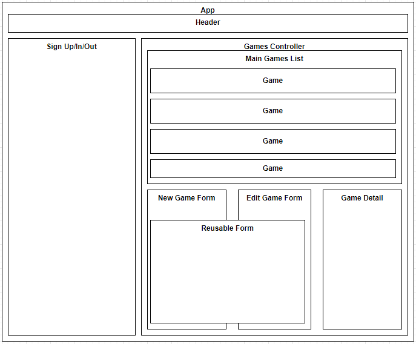

# _Looking For Group_

#### By _**Matt C.**_

#### _A network to allow players and DMs to coordinate and arrange game sessions for Dungeons and Dragons._

## Technologies Used

* 

## Component Diagram

## Description

_My capstone project at Epicodus._

## Setup/Installation Requirements

* _Run `git clone https://github.com/catperso/looking-for-group` from the terminal to clone the project directory to your device._
* _cd into the tap-room-react directory then run `npm install` from the terminal to set up the environment and install all the npm packages._
* _Run `npm run start` from the terminal to build the project and start a live development server._
* _Navigate to `localhost:3000` in your favorite web browser to enjoy the project._

## Known Bugs

* _There is no website yet._

### Research & Planning Log
#### Friday, 02/18
* 8:20am - Finish up React + Redux classwork
* 8:45am - Initialize local and remote project repositories
* 9:00am - Initialize README.md, begin recap/research on the steps to building a react app from scratch
* 9:45am - Break to apply for a job
* 10:30am - WIP rudimentary planning of component and database structure
* 11:30am - lunch break
* 12:30pm - researching on using persistent databases with react
* 1:00pm - research on using Firebase
* 1:54pm - recover from BSOD while installing Firebase to test project
* 2:15pm - sanity break
* 2:30pm - continue practicing with firebase and firestore
* 3:00pm - continue practice, if all goes well I'll be doing the project in React/Firestore instead of Ruby/Rails
* 4:10pm - short break
* 4:30pm - begin work on capstone-proposal.md
* 4:56pm - complete capstone-proposal.md and submit to epicenter
#### Friday, 02/25
* 8:30am - Begin setting up Firebase project
* 9:00am - Install Firebase and set up .env file
* 9:20am - Prune extra files from the project and begin setting up reducers and app structure
* 9:40am - add component-diagram.png
* 10:30am - Initialize all component files
* 11:00am - Research and to-do planning
* 12:00pm - Lunch Break
* 1:00pm - Remember to commit changes; continue recapping redux structure
* 2:00pm - Back to coding
* 4:30pm - Consulting with DMs to finalize what they think the game details pages should look like
* 4:59pm - Submit to Epicenter
#### Friday, 03/04
* 8:30am - Back on the grind
* 10:30am - research on integrating google analytics
* 11:30am - WIP finish GameControl.js
* 1:00pm - back from lunch
* 2:20pm - gamecontrol is functioning!

## License - [MIT](https://opensource.org/licenses/MIT)

_If you run into any problems/bugs feel free to send me an email [(mc.casperson@gmail.com)](mailto:mc.casperson@gmail.com) with details._

Copyright (c) _2022_ _Matt C._